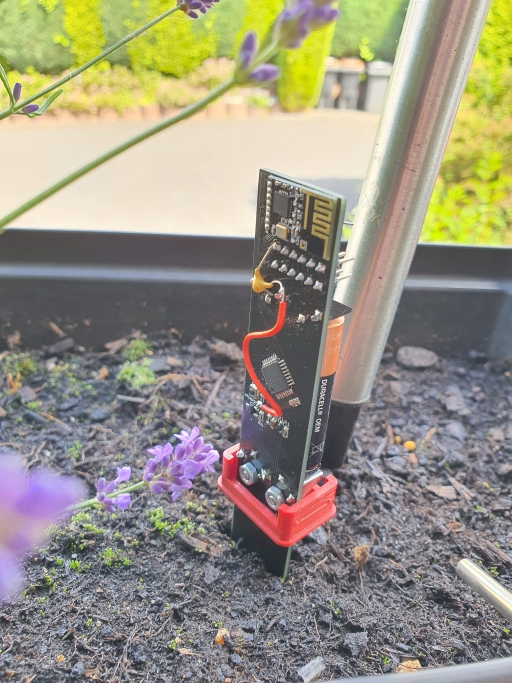

# Capacitive Soil Moisture Sensor

This is a capacitive soil moisture sensor which runs with a standalone ATmega328P and utilizes the MySensors framework.
It can however be adapted to any other framework that uses 2.4 GHz radio communication with a NRF24L01 if you upload your own code.

A short summary of the features is:
* Runs on 2 AAA batteries
* Uses a NRF24L01 radio module for communication
* Utilizes an ATSHA204A for secure message signing
* A sensor value range of approximately 400 (from air to water)
* External 8MHz resonator for better temperature stability than the interal oscillator
* All SMD components (except the nrf24l01 radio) on one side of the pcb
* 3D printable case which should make the electronics waterproof if the seam to the pcb is sealed with silicone e.g.

**Note: Take care when inserting the batteries as there is no reverse polarity protection on this board. Also check the pin assignment of the FTDI and AVR ISP headers as these might be non standard to save some space.**

## Getting Started

    git clone --recurse-submodules https://github.com/RonMcKay/capacitive-soil-moisture-sensor

The PCB design is done in KiCad. You are pretty much good to go if you open the project with KiCad.
The only thing that you need to add is the environment variable `MYSLOCAL={root-path-to-the-hardware-folder}/lib`

For programming and burning the bootloader I use [Visual Studio Code](https://code.visualstudio.com/)
together with [PlatformIO](https://platformio.org/) and [MiniCore](https://github.com/MCUdude/MiniCore)
(which is already included in the platform io plugin for vs code).

## Future Improvements

Here is a list of possible future improvements that might be worth looking into:

* Incorporating a voltage booster to increase battery runtime
* Increase water proofing of the case by adding an o-ring at the bottom of the thread
* Improve the thread model for easier printing and shorter screw on
* Maybe improve the battery holder for increased stability
* Add ready to use production files for JLCPCB, including SMT assembly files
* Some temperature readings of the soil would be awesome, like an SMD thermistor or something similar at the tip of the sensor.

Any contributions are highly welcome and I am happy to discuss remarks in the [github discussion](https://github.com/RonMcKay/capacitive-soil-moisture-sensor/discussions) section.

## License

This project is licensed under the CERN-OHL-P v2

## Special Thanks to

* [MySensors Team](https://www.mysensors.org), which made me start creating my own IoT hardware
* miceuz, for his [long writeup](https://wemakethings.net/2012/09/26/capacitance_measurement/) of how capacitive soil moisture sensing is working
* Ken Shirriff, whos post about the [secrets of arduino PWM](http://www.righto.com/2009/07/secrets-of-arduino-pwm.html) made me understand the topic to a certain extend
* Everyone out there who is producing open source hardware and/or guides explaining the topic, which makes the diy electronics topic more accessible

P.S.: The sensor on the photos is only a prototype where I accidentally soldered some wrong value capacitor and forgot a capacitor for the FTDI connector. These are however already fixed in the BOM and pcb design.

